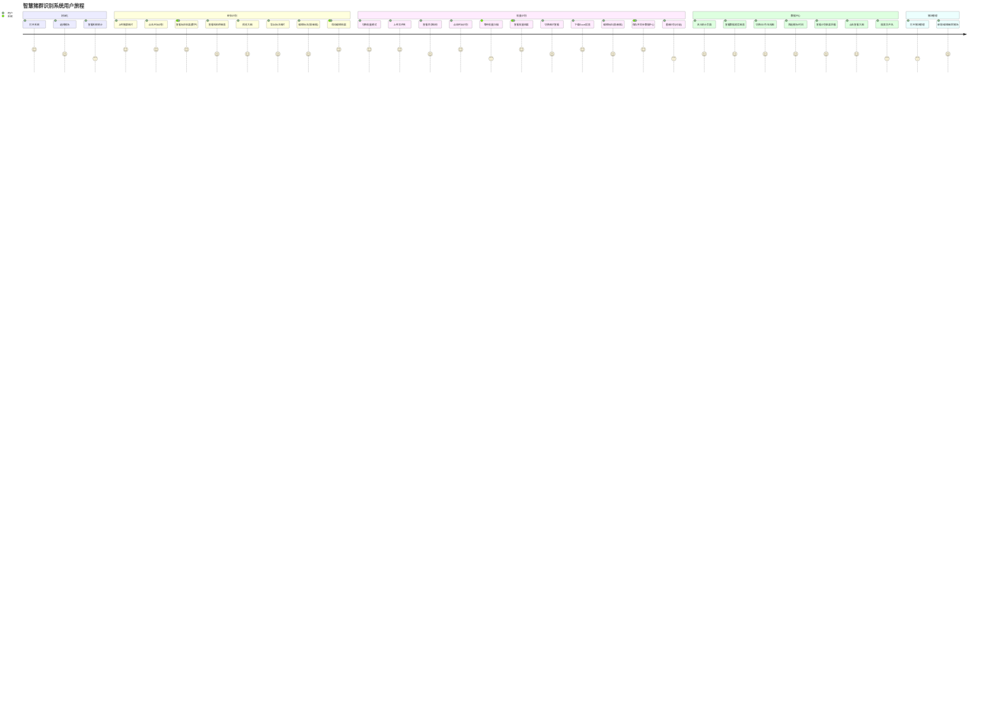
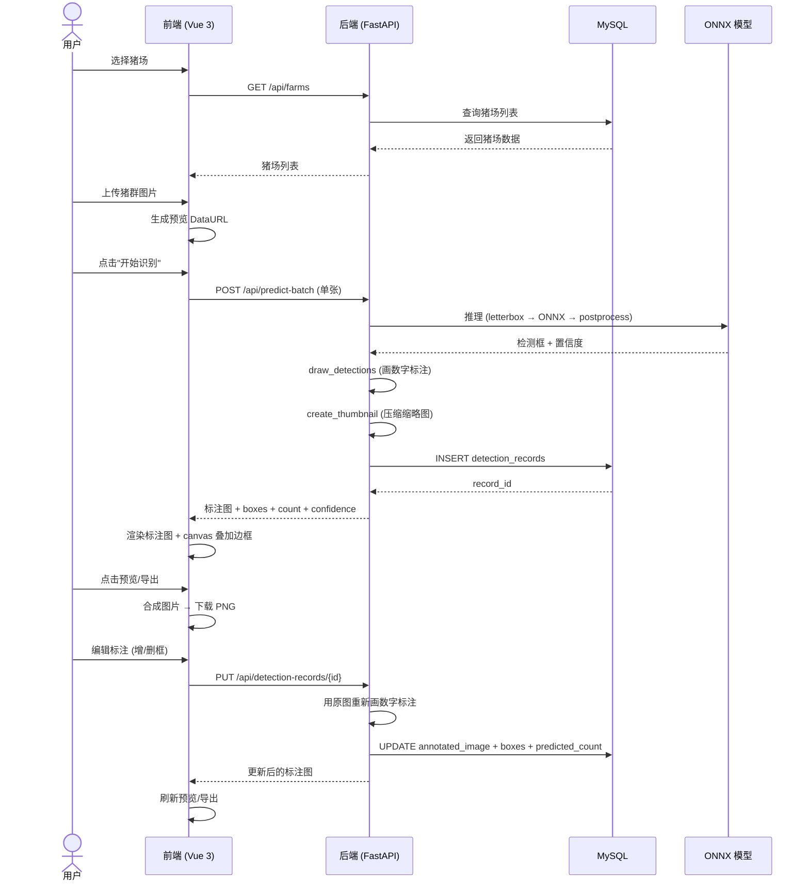
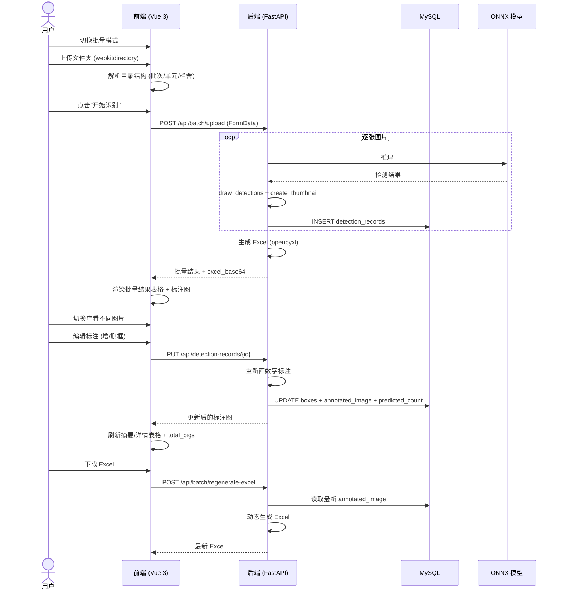
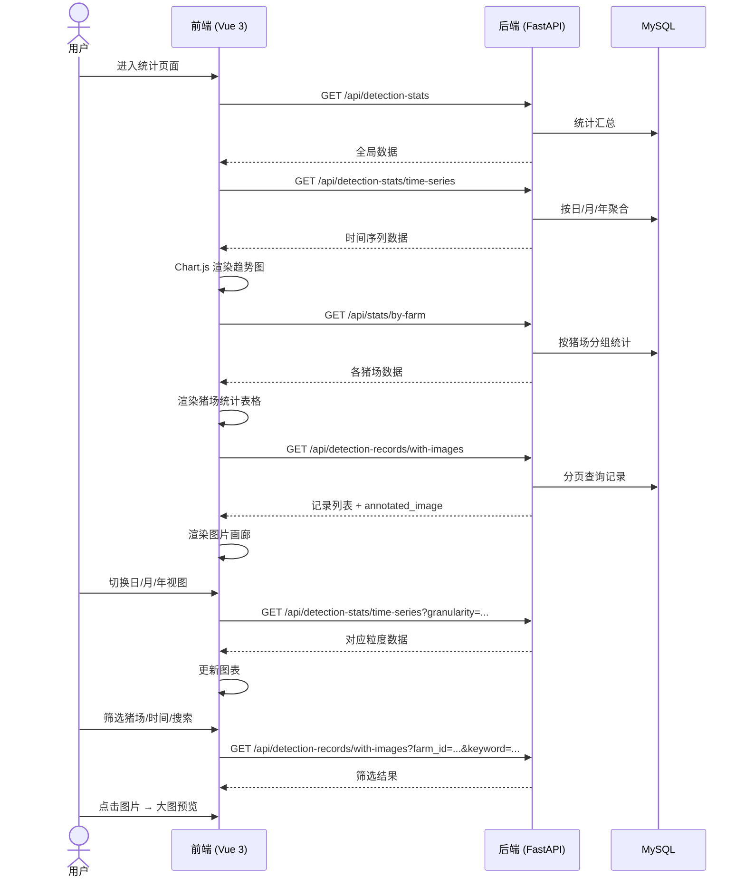
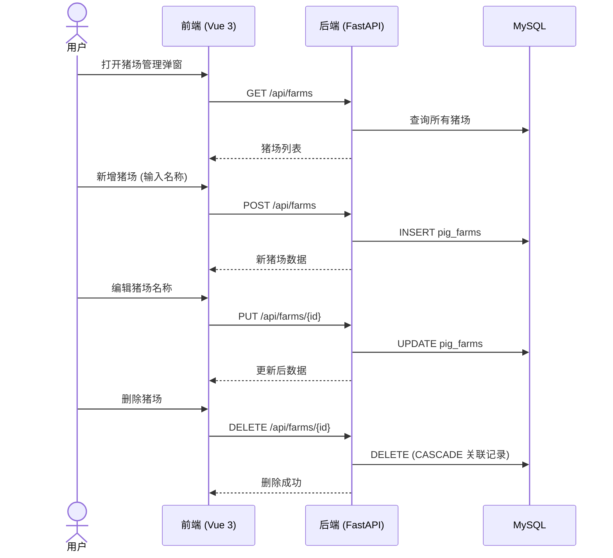

# 智慧猪群识别系统 — 用户旅程图 & 泳道图

## 一、用户旅程图

```mermaid
journey
    title 智慧猪群识别系统用户旅程
    section 初始化
      打开系统: 5: 用户
      选择猪场: 4: 用户
      查看系统统计: 3: 用户
    section 单张识别
      上传猪群图片: 5: 用户
      点击开始识别: 5: 用户
      查看标注结果(数字): 5: 系统, 用户
      查看检测明细表: 4: 用户
      预览大图: 4: 用户
      导出标注图片: 4: 用户
      编辑标注(增/删框): 4: 用户
      保存编辑结果: 5: 系统, 用户
    section 批量识别
      切换批量模式: 5: 用户
      上传文件夹: 5: 用户
      查看目录结构: 4: 用户
      点击开始识别: 5: 用户
      等待批量扫描: 3: 系统
      查看批量结果: 5: 系统, 用户
      切换图片查看: 4: 用户
      下载Excel报表: 5: 用户
      编辑标注(增/删框): 4: 用户
      保存并同步数据中心: 5: 系统, 用户
      重新识别(可选): 3: 用户
    section 数据中心
      进入统计页面: 4: 用户
      查看数据趋势图表: 4: 用户
      切换日/月/年视图: 4: 用户
      筛选猪场/时间: 4: 用户
      查看识别结果回看: 4: 用户
      点击查看大图: 4: 用户
      搜索文件名: 3: 用户
    section 猪场管理
      打开猪场管理: 3: 用户
      新增/编辑/删除猪场: 4: 用户
```

## 二、泳道图 — 单张识别流程

```mermaid
sequenceDiagram
    actor 用户
    participant 前端 as 前端 (Vue 3)
    participant 后端 as 后端 (FastAPI)
    participant 数据库 as MySQL
    participant 模型 as ONNX 模型

    用户->>前端: 选择猪场
    前端->>后端: GET /api/farms
    后端->>数据库: 查询猪场列表
    数据库-->>后端: 返回猪场数据
    后端-->>前端: 猪场列表

    用户->>前端: 上传猪群图片
    前端->>前端: 生成预览 DataURL

    用户->>前端: 点击"开始识别"
    前端->>后端: POST /api/predict-batch (单张)
    后端->>模型: 推理 (letterbox → ONNX → postprocess)
    模型-->>后端: 检测框 + 置信度
    后端->>后端: draw_detections (画数字标注)
    后端->>后端: create_thumbnail (压缩缩略图)
    后端->>数据库: INSERT detection_records
    数据库-->>后端: record_id
    后端-->>前端: 标注图 + boxes + count + confidence

    前端->>前端: 渲染标注图 + canvas 叠加边框
    用户->>前端: 点击预览/导出
    前端->>前端: 合成图片 → 下载 PNG

    用户->>前端: 编辑标注 (增/删框)
    前端->>后端: PUT /api/detection-records/{id}
    后端->>后端: 用原图重新画数字标注
    后端->>数据库: UPDATE annotated_image + boxes + predicted_count
    后端-->>前端: 更新后的标注图
    前端->>前端: 刷新预览/导出
```

## 三、泳道图 — 批量识别流程

```mermaid
sequenceDiagram
    actor 用户
    participant 前端 as 前端 (Vue 3)
    participant 后端 as 后端 (FastAPI)
    participant 数据库 as MySQL
    participant 模型 as ONNX 模型

    用户->>前端: 切换批量模式
    用户->>前端: 上传文件夹 (webkitdirectory)
    前端->>前端: 解析目录结构 (批次/单元/栏舍)

    用户->>前端: 点击"开始识别"
    前端->>后端: POST /api/batch/upload (FormData)
    loop 逐张图片
        后端->>模型: 推理
        模型-->>后端: 检测结果
        后端->>后端: draw_detections + create_thumbnail
        后端->>数据库: INSERT detection_records
    end
    后端->>后端: 生成 Excel (openpyxl)
    后端-->>前端: 批量结果 + excel_base64

    前端->>前端: 渲染批量结果表格 + 标注图

    用户->>前端: 切换查看不同图片
    用户->>前端: 编辑标注 (增/删框)
    前端->>后端: PUT /api/detection-records/{id}
    后端->>后端: 重新画数字标注
    后端->>数据库: UPDATE boxes + annotated_image + predicted_count
    后端-->>前端: 更新后的标注图

    前端->>前端: 刷新摘要/详情表格 + total_pigs

    用户->>前端: 下载 Excel
    前端->>后端: POST /api/batch/regenerate-excel
    后端->>数据库: 读取最新 annotated_image
    后端->>后端: 动态生成 Excel
    后端-->>前端: 最新 Excel
```

## 四、泳道图 — 数据中心（统计页面）

```mermaid
sequenceDiagram
    actor 用户
    participant 前端 as 前端 (Vue 3)
    participant 后端 as 后端 (FastAPI)
    participant 数据库 as MySQL

    用户->>前端: 进入统计页面
    前端->>后端: GET /api/detection-stats
    后端->>数据库: 统计汇总
    后端-->>前端: 全局数据

    前端->>后端: GET /api/detection-stats/time-series
    后端->>数据库: 按日/月/年聚合
    后端-->>前端: 时间序列数据
    前端->>前端: Chart.js 渲染趋势图

    前端->>后端: GET /api/stats/by-farm
    后端->>数据库: 按猪场分组统计
    后端-->>前端: 各猪场数据
    前端->>前端: 渲染猪场统计表格

    前端->>后端: GET /api/detection-records/with-images
    后端->>数据库: 分页查询记录
    后端-->>前端: 记录列表 + annotated_image
    前端->>前端: 渲染图片画廊

    用户->>前端: 切换日/月/年视图
    前端->>后端: GET /api/detection-stats/time-series?granularity=...
    后端-->>前端: 对应粒度数据
    前端->>前端: 更新图表

    用户->>前端: 筛选猪场/时间/搜索
    前端->>后端: GET /api/detection-records/with-images?farm_id=...&keyword=...
    后端-->>前端: 筛选结果

    用户->>前端: 点击图片 → 大图预览
```

## 五、泳道图 — 猪场管理

```mermaid
sequenceDiagram
    actor 用户
    participant 前端 as 前端 (Vue 3)
    participant 后端 as 后端 (FastAPI)
    participant 数据库 as MySQL

    用户->>前端: 打开猪场管理弹窗
    前端->>后端: GET /api/farms
    后端->>数据库: 查询所有猪场
    后端-->>前端: 猪场列表

    用户->>前端: 新增猪场 (输入名称)
    前端->>后端: POST /api/farms
    后端->>数据库: INSERT pig_farms
    后端-->>前端: 新猪场数据

    用户->>前端: 编辑猪场名称
    前端->>后端: PUT /api/farms/{id}
    后端->>数据库: UPDATE pig_farms
    后端-->>前端: 更新后数据

    用户->>前端: 删除猪场
    前端->>后端: DELETE /api/farms/{id}
    后端->>数据库: DELETE (CASCADE 关联记录)
    后端-->>前端: 删除成功
```
